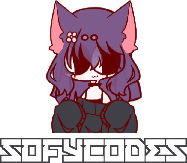
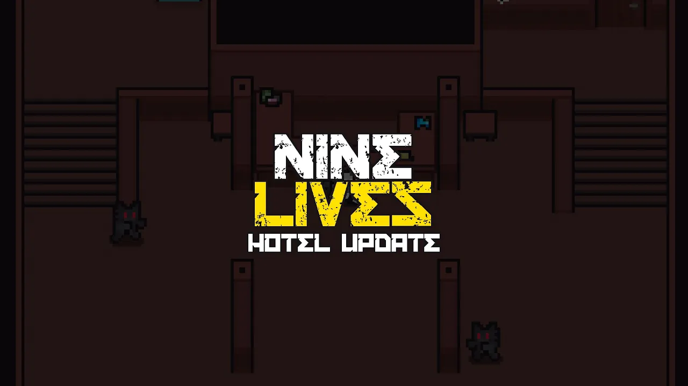
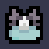
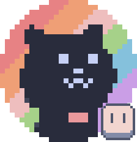

<div style ="tc display:flex;" align="center">
  <a href="https://www.youtube.com/watch?v=_e9yMqmXWo0"></a>
</div>

<div align="center">
<p align="center">
<a href="https://www.youtube.com/channel/UCk1zfyn_jBVkkYiQ9FCmtig"></a>
<a href="https://www.youtube.com/channel/UCk1zfyn_jBVkkYiQ9FCmtig"></a>
<a href="https://sofycodes.itch.io/"></a>
<a href="https://discord.gg/YH9UYRgQxp"></a>
<a href="https://ko-fi.com/sofycat"></a>
</p>
</div>

## 

```csharp
public class Sofy : Cat {
    // Basic info
    public string Pronouns = "She/They";
    public string Gender = "Female";
    public string Location = "Australia";
    public string Timezone = "AEST (UTC+10)";

    // Programming
    public List<string> Projects = new() { "Nine Lives", "Genesis" };
    public List<string> FavoriteLanguages = new() { "GML", "C#" };
}
```
<div align="center">
<br>

# Latest Video
<a href="https://www.youtube.com/watch?v=zwvHnvKLP0w"></a>
# Projects

<table align="center">
    <tr>
        <td colspan="4" align="center"><a></a><br><b></b><br>
		All my main projects, all in one place</td>
    </tr>
    <tr>
        <td align="right"><a href="https://github.com/sofycodes/NineLives"></a></td>
        <td><a href="https://github.com/sofycodes/NineLives">Nine Lives</a><br>🐈 Hoard-Round-Based roguelite shooter</td>
	<td align="right"><a href="https://github.com/catppuccin/aseprite"></a></td>
        <td><a href="https://github.com/catppuccin/aseprite">Catprite</a><br>🖍 Soothing pastel theme for Aseprite</td>
    </tr>
    <tr>
	<td align="right"><a href="https://github.com/sofycat/Genesis"></a></td>
        <td><a href="https://github.com/sofycat/Genesis">Genesis</a><br>🧭 Custom orign-points for gamemaker</td>    
    </tr>
</table>

Thanks for reading if you've made it this far! Below are my Repo's! 🌺🐝
<br>
<br>
[](https://ko-fi.com/sofycat)
