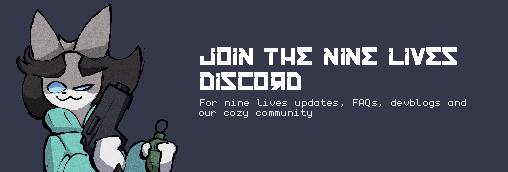

  

## 

A GameDev delving into the depths of my  spaghetti code. Join me on my journey!!

 

	
**Check out my latest Youtube Video**

 

## Projects

 

<table align="center">
    <tr>
        <td colspan="4" align="center"> <b></b> 
		All my gamemaker libraries, all in one place</td>
    </tr>
    <tr>
        <td align="right"></td>
        <td><a href="https://github.com/SofyCodes/consoleMe">ConsoleMe</a> 🪴Retro modular dev-console for GameMaker</td>
	<td align="right"></td>
        <td><a href="https://github.com/catppuccin/aseprite">Catprite</a> 🖍 Soothing pastel theme for Aseprite</td>
    </tr>
</table>

Thanks for reading if you've made it this far! Below are my Repo's! 🌺🐝

